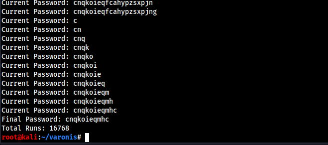

# vault solve

Due to the inaccuracies seen when comparing timing of each character, a multi-stage bruteforce was created. The PyCharm IDE was not usable due to overall instability, and a tendency to crash, VS Code was used instead.
An initial base assumptions was made that the password would not be longer than 20 characters, and was used as part of the initial testing.

## usage
Ensure that the `vault.o` binary is in the same directory as the script.

`python3.7 poc.py`

